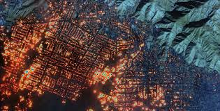

# Mapping the Eaton and Palisades Fires In Los Angeles

## About
This repository contains the notebook `hw4-task2-False-Color-Mapping-Kadonoff.ipynb` so that we may visualize the burn areas of the Eaton and Palisades fires across the greater Los Angeles area. By examining geojson fire perimeter polygons as well as true and false color raster landsat data bands, we have created a map by which we may analize and better understand the extent to which these fires impacted the Los Angeles Community.

## Repository Structure

eds220-hwk4/
│
├── README.md
├── data/
│     └── Wildfire.jpg
│     └── Eaton_Perimeter_20250121.geojson
│     └── landsat8-02-23-palisades-eaton.nc
│     └── Palisades_Perimeter_20250121.geojson
└── hw4-task2-False-Color-Mapping-Kadonoff.ipynb

## Data Access

All data required to create the map found within the `data` folder located within this repository, or may be accessed by downloading the files directly from the links below:

Landsat Collection 2 Level-2 data: https://planetarycomputer.microsoft.com/dataset/landsat-c2-l2

Eaton and Palisades Fire geojson: https://hub.arcgis.com/maps/ad51845ea5fb4eb483bc2a7c38b2370c/about

## References

1. NIFC FIRIS (2025). Palisades and Eaton Dissolved Fire Perimeters (2025, Jan. 21). https://hub.arcgis.com/maps/ad51845ea5fb4eb483bc2a7c38b2370c/about [Accessed 11/20/2025]

2.  United States Geological Survey. Landsat Collection 2 Level-2: Microsoft Planetary Computer. (2024). https://planetarycomputer.microsoft.com/dataset/landsat-c2-l2 [Accessed 11/20/2025]